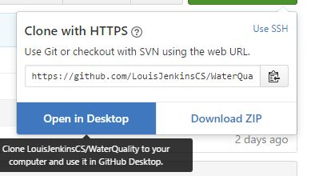
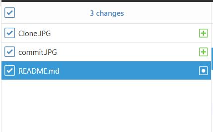
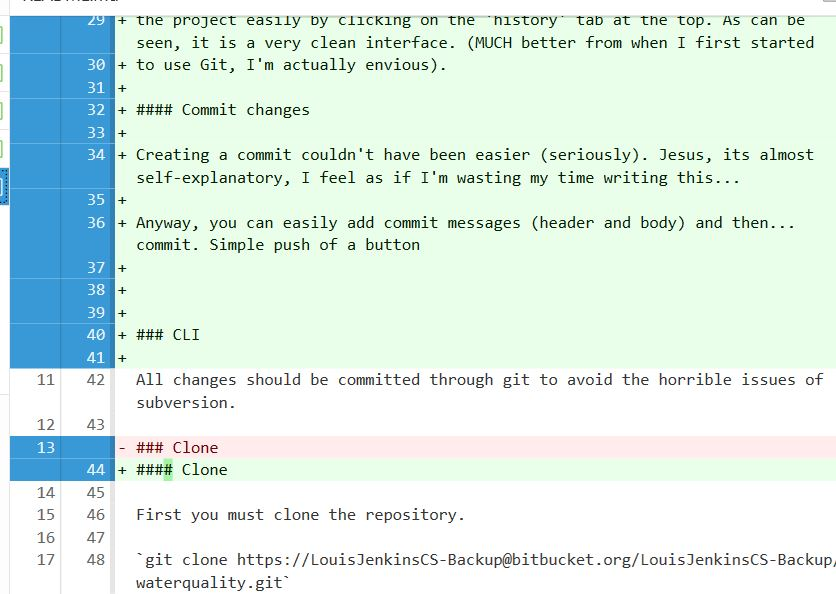
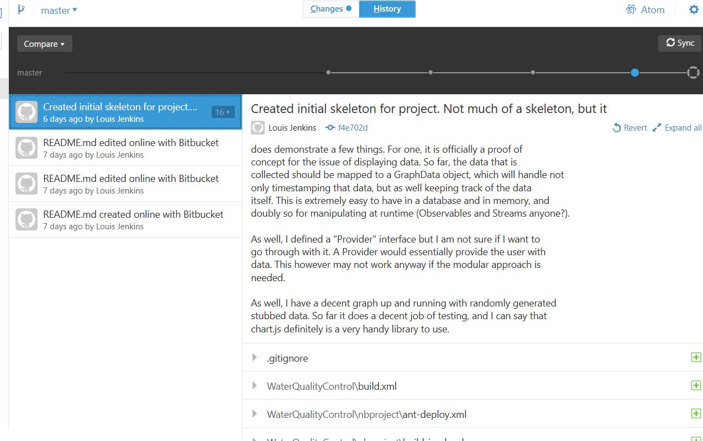
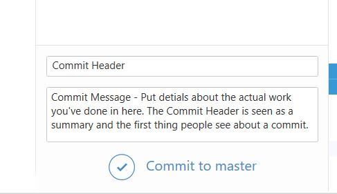

# Water Quality Real-time monitoring station web interface

Software Engineering project repository

## Why

Potential backup repository, and hopefully where all changes are committed to first. The upsides to using BitBucket are many, from using the issue tracker to post potential bugs and updates in a centralized place (no need for emails or once-a-week meetings), detailed commit logs, a nice front-end for commit-logs, etc. As well, it allows you to comment on changes that were committed, making it possible to do peer-reviews remotely. When we need to commit work, we can handle any pull requests and merges here and push out the final update through subversion for Dr. Jones and just forward him the commit logs needed.

## How to Download

### GUI

Screenshots are of the official GitHub Desktop application, which can be downloaded from [here](https://desktop.github.com/)

#### Clone

A clone with GitHub Desktop is extremely simple. Hit that green "Clone or Download" button, and select "Open In Desktop"

#### Adding Work You've Done

GitHub Desktop automatically includes any files you have changed on your local copy. Files added usually appear with a '+' icon. Deleted
files, I believe, have a '-' icon.

You can review the changes of any given file easily by clicking on it (seriously, they make it dead-easy). The green highlighted portions are
'added' lines of code, and the red are 'deleted' lines. Sometimes lines that are modified show up as both deleted (as the old one was) and added
(as the new one replaced it), which is fine.

If you ever get confused on what changes, or what some changelogs on what others have done (or even that you've done), you can see the 'history' of
the project easily by clicking on the 'history' tab at the top. As can be seen, it is a very clean interface. (MUCH better from when I first started
to use Git, I'm actually envious).

#### Commit changes

Creating a commit couldn't have been easier (seriously). Jesus, its almost self-explanatory, I feel as if I'm wasting my time writing this...

Anyway, you can easily add commit messages (header and body) and then... commit. Simple push of a button.

#### Pull Updates (and sync changes)

Not even going to bother with this one. There's a 'sync' button in the upper right corner. Enjoy...

### CLI

All changes should be committed through git to avoid the horrible issues of subversion.

#### Clone

First you must clone the repository.

`git clone https://LouisJenkinsCS-Backup@bitbucket.org/LouisJenkinsCS-Backup/waterquality.git`

#### How to add work you've done

Add all files to be committed
 
`git add --all`

Or particular files

`git add file1 file2`

#### Commit changes

Create commit message (Requires an editor such as vim, emac, or nano)

`git commit`

Create commit without using text editor

`git commit -m "Message"`

Push update

`git push`

Push update to specific branch

`git push --origin branch`

#### Create a branch

Branches allow for updates on a snapshot of the repository without frustrations of merge conflicts. At the end a pull request can be made to resolve this after work is done.

`git checkout -b branch`

#### Pull Updates (and sync changes)

Unlike subversion, you must be up to date before pushing out an update. This prevents pushing out code that is not up to date.

`git pull`