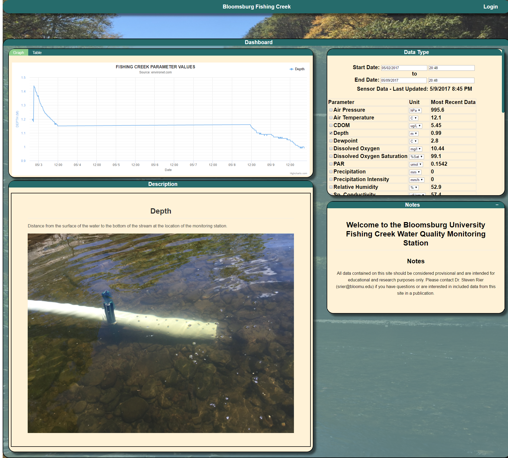
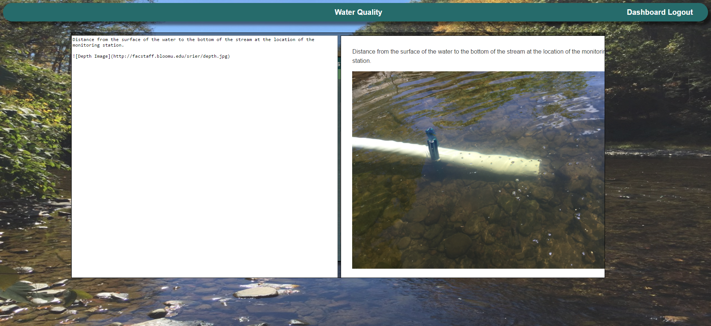

# Water Quality

A collaborative project for a Software Engineering course
between @LouisJenkinsCS, @bmeglathery, @TylerMutzekCS, @ktc45622, and @dan0x19b.
The project is currently, as of this posting, deployed on Bloomsburg University's
web server, seen [here](https://cswebserver.bloomu.edu:8443/WaterQuality/).

WaterQuality is a automated system used to monitor the status of Bloomsburg's Fishing Creek,
of which is of great interest to our client, Steven Rier, a Bloomsburg University biology professor.
The website allows users to see graphed values emitted by the creek every 15 minute interval and
even allows Dr. Rier to host his own manual data to the server to be graphed.

## Screenshots

### Dashboard

### Admin Page + Preview

Both the parameter descriptions and admin notes can be seen with a WYSIWYG preview
that updates as you type, allowing you to use Markdown, HTML, and/or plain text for
formatting.

## Developer Note

The semester this application was developed was a very stressful one, as such it resulted in a lack of code quality, and on behalf of the entire team I would like to say that it does not represent our collective skills and overall ability as programmers.
